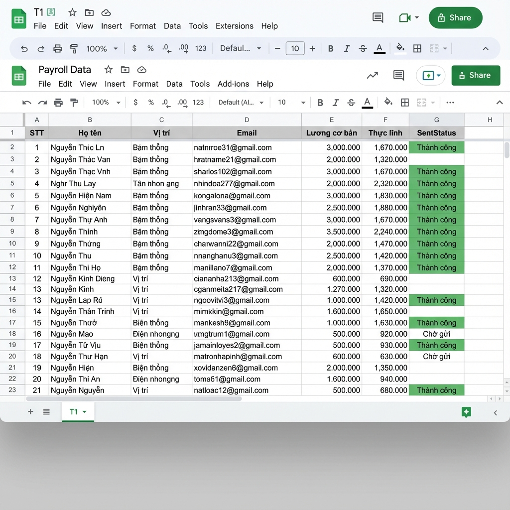
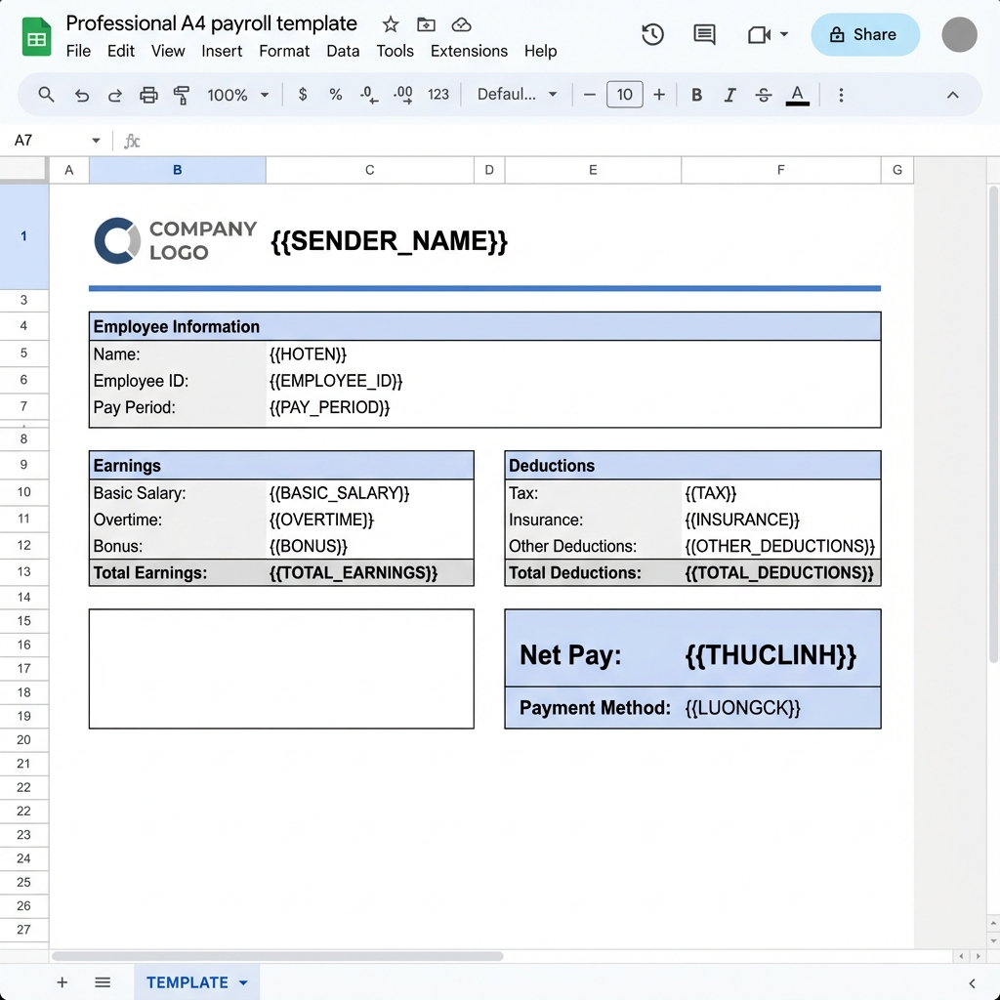
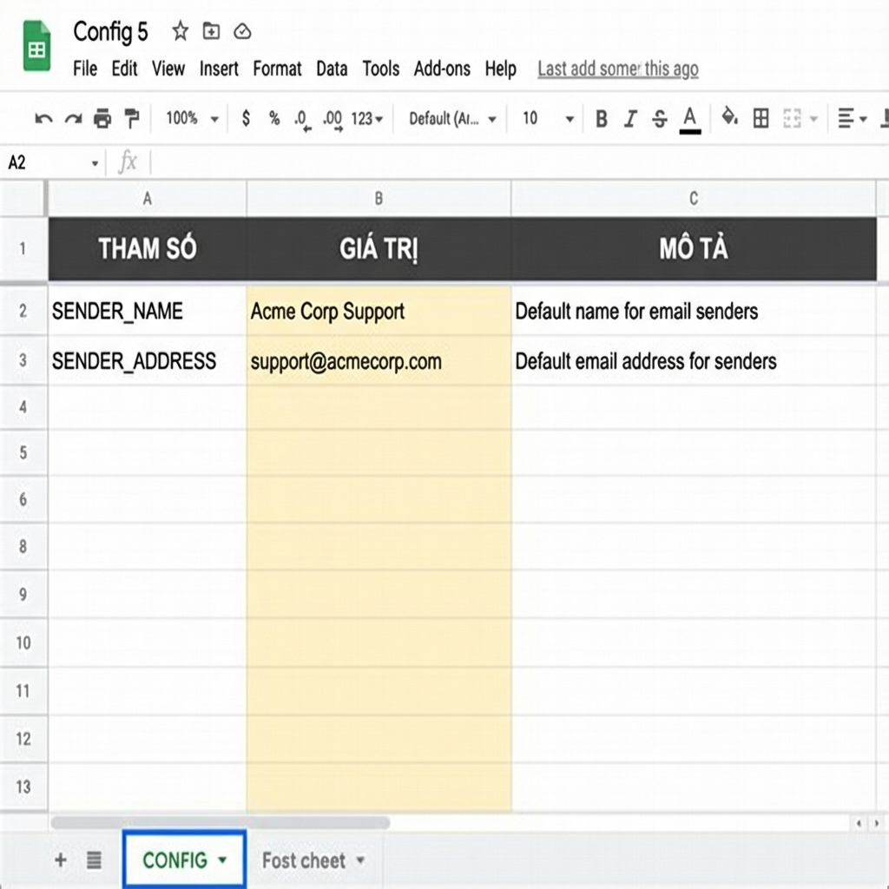
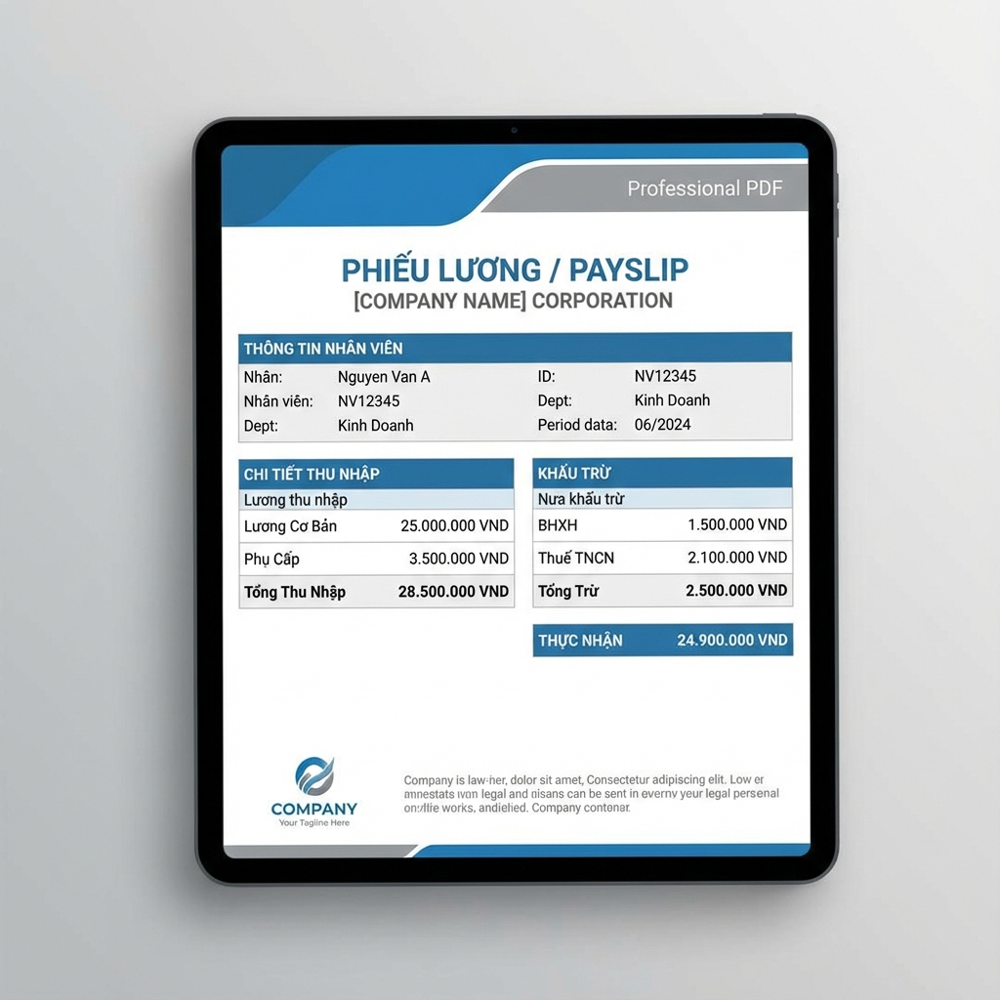

# 📘 CẨM NANG SỬ DỤNG CHI TIẾT — Công cụ Gửi Phiếu Lương Tự động (SME Tools v2.2)

> **Tài liệu này dành cho ai?**
> Dành cho người **chưa từng lập trình, không rành máy tính**. Mỗi thao tác được mô tả tới từng cú nhấp chuột. Bạn **không cần hiểu code** — chỉ cần làm theo đúng thứ tự.
>
> **Nên đọc thế nào?**
> - Lần đầu: đọc tuần tự từ trên xuống, làm tới đâu đánh dấu tới đó.
> - Các lần sau: chỉ cần xem **Phần E (Gửi thử)** và **Phần F (Gửi thật)**.
> - Khi gặp trục trặc: nhảy tới **Phần I (Xử lý sự cố)**.
>
> **Thời gian cài đặt lần đầu:** khoảng **15–20 phút**. Sau đó mỗi tháng chỉ mất **2–5 phút**.

---

## 🧭 MỤC LỤC

1. [Công cụ này làm được gì?](#1-công-cụ-này-làm-được-gì)
2. [Bạn cần chuẩn bị gì trước](#2-bạn-cần-chuẩn-bị-gì-trước)
3. [Từ điển thuật ngữ (đọc 1 lần cho đỡ bỡ ngỡ)](#3-từ-điển-thuật-ngữ)
4. [PHẦN A — Cài đặt lần đầu (chỉ làm 1 lần)](#phần-a--cài-đặt-lần-đầu-chỉ-làm-1-lần)
5. [PHẦN B — Chuẩn bị bảng dữ liệu lương](#phần-b--chuẩn-bị-bảng-dữ-liệu-lương)
6. [PHẦN C — Tạo mẫu phiếu lương (TEMPLATE)](#phần-c--tạo-mẫu-phiếu-lương-template)
7. [PHẦN D — Tạo và hiểu trang Cấu hình (CONFIG)](#phần-d--tạo-và-hiểu-trang-cấu-hình-config)
8. [PHẦN E — Gửi thử (BẮT BUỘC trước khi gửi thật)](#phần-e--gửi-thử-bắt-buộc-trước-khi-gửi-thật)
9. [PHẦN F — Gửi phiếu lương thật](#phần-f--gửi-phiếu-lương-thật)
10. [PHẦN G — Lưu trữ Drive, Nhật ký LOG & Bảo mật](#phần-g--lưu-trữ-drive-nhật-ký-log--bảo-mật)
11. [PHẦN H — Gửi lại / sửa sai (Reset)](#phần-h--gửi-lại--sửa-sai-reset)
12. [PHẦN I — Xử lý sự cố (bảng tra nhanh)](#phần-i--xử-lý-sự-cố)
13. [PHẦN J — Câu hỏi thường gặp](#phần-j--câu-hỏi-thường-gặp)
14. [PHẦN K — Quy tắc an toàn KHÔNG được quên](#phần-k--quy-tắc-an-toàn)
15. [PHẦN L — Giới hạn đã biết của công cụ](#phần-l--giới-hạn-đã-biết)
16. [PHẦN M — Bảng tra thẻ {{...}} ↔ cột ↔ ý nghĩa (toàn bộ)](#phần-m--bảng-tra-thẻ)
17. [Phụ lục — Checklist trước mỗi lần gửi](#phụ-lục--checklist-trước-mỗi-lần-gửi)

---

## 1. Công cụ này làm được gì?

Hãy hình dung mỗi tháng bạn phải:
- Mở bảng lương,
- Cắt phần lương của **từng người**,
- Dán vào một phiếu đẹp,
- Lưu thành PDF,
- Đính kèm email và gửi cho đúng người.

Nếu công ty có 50 người, bạn phải lặp lại **50 lần**. Rất mệt và dễ gửi nhầm.

**Công cụ này làm thay bạn toàn bộ việc đó.** Bạn chỉ cần bấm 1 nút, nó sẽ:
1. ✅ Đọc bảng lương của bạn.
2. ✅ Với **mỗi nhân viên**, tự điền số liệu vào mẫu phiếu lương đẹp.
3. ✅ Xuất thành **file PDF**.
4. ✅ (Tùy chọn) **Lưu PDF vào Google Drive** theo thư mục Năm → Tháng.
5. ✅ **Gửi email** kèm phiếu PDF tới đúng email của từng người.
6. ✅ Ghi lại **nhật ký** đã gửi cho ai, lúc nào.
7. ✅ Gửi cho bạn một **email báo cáo tổng kết** khi xong.

Nếu danh sách dài và Google bắt nghỉ giữa chừng (giới hạn 6 phút), công cụ **tự động chạy tiếp** mà bạn không cần đụng vào.

> 💡 Công cụ chạy **bên trong chính Google Sheets bảng lương của bạn**, không phải phần mềm cài đặt riêng. Không tốn phí.

---

## 2. Bạn cần chuẩn bị gì trước

| Cần có | Giải thích |
|--------|-----------|
| 1 tài khoản **Google (Gmail)** | Email gửi đi cho nhân viên chính là email này. Nên dùng email công ty (vd `hr@congty.com`). |
| 1 file **Google Sheets** chứa bảng lương | Nếu lương đang ở Excel, hãy tải lên Google Drive rồi mở bằng Google Sheets. |
| Khoảng **15–20 phút** yên tĩnh cho lần đầu | Các lần sau rất nhanh. |
| Danh sách **email nhân viên** chính xác | Sai email = gửi nhầm hoặc không gửi được. |

> ⚠️ **Lưu ý về số lượng gửi/ngày:** Gmail thường chỉ cho gửi tối đa **~100 email/ngày**; tài khoản Google Workspace (email công ty trả phí) khoảng **~1.500 email/ngày**. Nếu công ty đông hơn mức này, hãy chia ra gửi nhiều ngày (công cụ tự nhớ ai đã nhận, xem [Phần H](#phần-h--gửi-lại--sửa-sai-reset)).

---

## 3. Từ điển thuật ngữ

Đọc nhanh 1 lần để khỏi hoang mang khi gặp các từ này:

| Từ | Nghĩa dễ hiểu |
|----|----------------|
| **Sheet / Bảng tính** | Chính là file Google Sheets bảng lương của bạn. |
| **Tab (trang/sheet con)** | Các thẻ ở **đáy màn hình** (vd `T1`, `T2`, `CONFIG`). Một file có nhiều tab. |
| **Apps Script** | "Động cơ" chạy ẩn bên trong Google Sheets. Bạn dán code vào đây 1 lần rồi quên nó đi. |
| **Code / Mã nguồn** | Đoạn chữ kỹ thuật bạn sẽ sao chép–dán. Không cần hiểu. |
| **Menu SME Tools** | Thực đơn mới xuất hiện trên thanh công cụ sau khi cài, nơi bạn bấm nút để chạy. |
| **TEMPLATE** | Tab chứa **mẫu phiếu lương** (khung trống có chỗ để máy điền số). |
| **CONFIG** | Tab chứa **các thiết lập** (tên công ty, bật/tắt tính năng…). |
| **LOG** | Tab **nhật ký** ghi lại lịch sử đã gửi. |
| **Thẻ `{{...}}`** | Chỗ trống trong mẫu để máy điền dữ liệu vào, vd `{{HOTEN}}` → tên nhân viên. |
| **PDF** | Định dạng file in ấn, gửi đi không bị xô lệch. Phiếu lương gửi đi ở dạng này. |
| **Quota** | Hạn mức số email Google cho gửi trong 1 ngày. |
| **Trigger** | Hẹn giờ tự động. Công cụ tự đặt khi cần chạy tiếp, bạn không cần biết. |

---

## PHẦN A — Cài đặt lần đầu (chỉ làm 1 lần)

> 🎯 Mục tiêu phần này: dán "động cơ" vào file Sheets và cấp quyền cho nó chạy. Làm **đúng 1 lần duy nhất**, các tháng sau không cần lặp lại.

### A1. Mở file bảng lương
1. Vào **drive.google.com**, mở file **Google Sheets** bảng lương của bạn.

### A2. Mở Apps Script
1. Trên thanh thực đơn phía trên, nhấn **Tiện ích mở rộng** (tiếng Anh: **Extensions**).
2. Chọn **Apps Script**.
3. Một **tab trình duyệt mới** sẽ mở ra — đây là nơi chứa "động cơ".

### A3. Xóa code cũ (nếu có) và dán code mới
1. Nếu trong ô soạn thảo đang có sẵn vài dòng (thường là `function myFunction() { }`), hãy **bôi đen tất cả và xóa sạch** cho trang trắng tinh.
2. Mở file mã nguồn [**salary_send.js**](./salary_send.js).
3. Nhấn **Ctrl + A** (chọn tất cả) rồi **Ctrl + C** (sao chép) toàn bộ nội dung file đó.
4. Quay lại tab Apps Script, nhấp vào vùng trống và nhấn **Ctrl + V** (dán).

### A4. Lưu lại
1. Nhấn biểu tượng **đĩa mềm (Lưu)** ở phía trên, hoặc nhấn **Ctrl + S**.
2. Nếu được hỏi tên dự án, gõ **SME Payroll Tool** rồi **Đồng ý**.

### A5. Cấp quyền cho công cụ chạy (bước hay làm người mới lo lắng nhất)

> 😟 Google sẽ hiện cảnh báo trông "đáng sợ". **Đừng lo** — đây là chuyện hoàn toàn bình thường vì đây là code nội bộ của bạn, Google chưa "kiểm duyệt công khai". Bạn làm theo đúng các bước sau:

1. Phía trên ô soạn thảo, tìm ô chọn hàm. Hãy chọn hàm tên **`sendMonthlyPayrollEmails_WithPDF`**, rồi nhấn nút **Chạy (Run)** ▶ bên cạnh.
2. Hiện hộp thoại **"Cần cấp quyền / Authorization required"** → nhấn **Xem lại quyền (Review Permissions)**.
3. Chọn **tài khoản Google** của bạn.
4. Màn hình báo **"Google chưa xác minh ứng dụng này / Google hasn't verified this app"**:
   - Nhấn **Nâng cao (Advanced)** ở góc dưới bên trái.
   - Nhấn dòng chữ nhỏ: **Đi tới SME Payroll Tool (không an toàn) / Go to SME Payroll Tool (unsafe)**.
   > Chữ "không an toàn" chỉ là cảnh báo mặc định cho mọi code tự viết — code của bạn an toàn.
5. Kéo xuống cuối danh sách quyền, nhấn **Cho phép (Allow)**.
6. Khi thấy dòng **"Đã hoàn tất thực thi / Execution completed"** ở dưới là xong.

### A6. Làm xuất hiện menu SME Tools
1. Quay lại **tab Google Sheets** bảng lương.
2. Nhấn phím **F5** (tải lại trang).
3. Sau vài giây, trên thanh thực đơn xuất hiện mục mới: **SME Tools** (nằm cạnh menu "Trợ giúp").

✅ **Hoàn tất cài đặt!** Từ giờ mỗi lần mở file, menu **SME Tools** luôn có sẵn.

Menu **SME Tools** gồm:
| Mục menu | Dùng để |
|----------|---------|
| **Gửi Phiếu Lương (Tháng Hiện Tại)** | Gửi lương cho tháng theo lịch hôm nay |
| **Gửi Phiếu Lương (Chọn Tháng...)** | Gửi lương một tháng bất kỳ bạn nhập |
| **Gửi THỬ về email tôi...** | Gửi 1 phiếu mẫu về email bạn để kiểm tra |
| **Xóa trạng thái gửi (Reset)** | Xóa dấu "đã gửi" để gửi lại từ đầu |
| **Tạo Sheet Mẫu (TEMPLATE)** | Tạo khung mẫu phiếu lương |
| **Tạo Sheet Cấu hình (CONFIG)** | Tạo trang thiết lập |

---

## PHẦN B — Chuẩn bị bảng dữ liệu lương

> 🎯 Mục tiêu: sắp xếp bảng lương đúng "khuôn" để máy đọc được.



### B1. Quy tắc tên tab tháng
- Mỗi tháng để ở **một tab riêng**, đặt tên **`T` + số tháng**:
  - Lương **tháng 1** → tab tên **`T1`**
  - Lương **tháng 5** → tab tên **`T5`**
- ❌ Không đặt `Tháng 1`, `T 1`, `Lương T1`… (nếu thật sự muốn kiểu khác, xem `SHEET_NAME_PREFIX` ở [Phần D](#phần-d--tạo-và-hiểu-trang-cấu-hình-config)).

### B2. Quy tắc bố trí dữ liệu
- **Dòng 1** = dòng **tiêu đề** (tên các cột).
- **Dữ liệu nhân viên** bắt đầu từ **dòng 2** trở xuống. Mỗi người 1 dòng.
- Các cột phải đúng vị trí mặc định (xem bảng đầy đủ ở [Phần M](#phần-m--bảng-tra-thẻ)). Quan trọng nhất:
  - **Cột F = Email** nhân viên (để gửi tới). **Phải chính xác**, có dấu `@`.
  - **Cột B = Họ tên**.
  - **Cột AO = Trạng thái gửi** — để **trống**, máy sẽ tự điền "Thành công" sau khi gửi.

### B3. Cách nhanh & chuẩn nhất: dùng file mẫu
1. Tải file mẫu: [**payroll_sample_2025.csv**](./payroll_sample_2025.csv).
2. Trong Google Sheets: **Tệp (File)** → **Nhập (Import)** → **Tải lên (Upload)** → chọn file mẫu.
3. Đổi tên tab thành `T1`, `T2`… theo tháng.
4. Thay dữ liệu mẫu bằng dữ liệu thật của bạn (giữ nguyên thứ tự cột).

> 💡 **Mẹo kiểm tra email:** trước khi gửi, lướt cột F xem có ô nào trống, sai chính tả, thiếu `@` không. Ô email sai sẽ bị bỏ qua hoặc gửi lỗi.

---

## PHẦN C — Tạo mẫu phiếu lương (TEMPLATE)

> 🎯 Mục tiêu: tạo "khung phiếu lương" đẹp, có sẵn các chỗ trống để máy điền số.



### C1. Tạo tự động
1. Vào menu **SME Tools** → **Tạo Sheet Mẫu (TEMPLATE)**.
2. Một tab mới tên `TEMPLATE` hiện ra với phiếu lương chuẩn A4 đã định dạng sẵn.

### C2. ⚠️ QUY TẮC VÀNG về thẻ `{{...}}`
Trong mẫu có những chữ nằm trong **hai ngoặc nhọn** như `{{HOTEN}}`, `{{TONGLUONG}}`, `{{LUONGCK}}`. Đó là **chỗ máy sẽ điền dữ liệu**.

- ✅ Bạn **được** di chuyển chúng sang ô khác, đổi màu, đổi font, đổi cỡ chữ.
- ❌ Bạn **KHÔNG được** xóa hay sửa tên bên trong ngoặc.
- ❗ **Thẻ phải VIẾT HOA toàn bộ và đúng tên**: `{{HOTEN}}` ✅ — chứ không phải `{{HoTen}}` ❌ hay `{{Ho Ten}}` ❌.

> 🚨 **CẢNH BÁO QUAN TRỌNG (hay gặp):**
> Nếu bạn lấy mẫu từ tài liệu cũ dùng thẻ kiểu `{{HoTen}}`, `{{TongLuong24}}` (chữ thường, có số) thì **máy sẽ KHÔNG điền được** và phiếu ra **trống chỗ đó**.
> Hãy luôn dùng đúng tên thẻ trong **[Bảng tra Phần M](#phần-m--bảng-tra-thẻ)**. Cách an toàn nhất: dùng menu **Tạo Sheet Mẫu (TEMPLATE)** để có sẵn thẻ đúng.

### C3. Tùy chỉnh cho đẹp
- Bạn có thể chèn **logo công ty**, đổi màu nền, thêm dòng chữ ký…
- Để PDF không bị tràn/lệch khi in: giữ **tổng độ rộng các cột trong khoảng 700–750px** (mẫu tạo sẵn đã chuẩn A4).

---

## PHẦN D — Tạo và hiểu trang Cấu hình (CONFIG)

> 🎯 Mục tiêu: thay đổi mọi thiết lập **mà không cần đụng vào code**.



### D1. Tạo trang CONFIG
1. Vào menu **SME Tools** → **Tạo Sheet Cấu hình (CONFIG)**.
2. Tab `CONFIG` hiện ra, chia thành các **nhóm** rõ ràng.
3. Bạn chỉ sửa giá trị ở **cột B (ô tô màu vàng)**. **Không sửa cột A.**

> 💡 **Nguyên tắc ưu tiên:** Nếu có tab `CONFIG`, máy luôn nghe theo giá trị trong đó (bỏ qua giá trị mặc định ẩn trong code). Nên nếu lỡ tay, cứ sửa lại trong CONFIG là được, không sợ "hỏng code".

### D2. Giải nghĩa TỪNG tham số

**Nhóm: Thông tin công ty** (hiện lên đầu phiếu lương)
| Tham số | Điền gì | Ví dụ |
|---------|---------|-------|
| `SENDER_NAME` | Tên công ty | CÔNG TY CỔ PHẦN ABC |
| `SENDER_ADDRESS` | Địa chỉ | Số 1 Đường X, Quận Y, Hà Nội |
| `SENDER_HOTLINE` | Số điện thoại hỗ trợ | 1900 1234 |
| `CONTACT_EMAIL` | Email **để nhân viên liên hệ** (KHÔNG phải email gửi đi) | hr@abc.com |

**Nhóm: Cấu trúc dữ liệu**
| Tham số | Điền gì | Mặc định |
|---------|---------|----------|
| `SHEET_NAME_PREFIX` | Tiền tố tên tab tháng | `T` (→ tab `T1`, `T2`…) |
| `START_ROW` | Dòng bắt đầu có dữ liệu nhân viên | `2` |

**Nhóm: Email**
| Tham số | Điền gì | Mặc định |
|---------|---------|----------|
| `EMAIL_SUBJECT_PREFIX` | Chữ đầu tiêu đề email | `Phiếu Lương` |
| `PDF_FILE_NAME_PREFIX` | Chữ đầu tên file PDF | `PhieuLuong` |
| `ATTACH_PDF_TO_EMAIL` | Có đính kèm PDF vào email không | `true` (có) |
| `MIN_QUOTA` | Số email tối thiểu còn lại thì mới gửi tiếp | `10` |

**Nhóm: Lưu trữ Drive**
| Tham số | Điền gì | Mặc định |
|---------|---------|----------|
| `SAVE_TO_DRIVE` | Có lưu phiếu vào Google Drive không | `true` (có) |
| `DRIVE_ROOT_FOLDER_NAME` | Tên thư mục gốc (máy tự tạo trong Drive của bạn) | `Phiếu lương SME` |
| `DRIVE_ROOT_FOLDER_ID` | (Nâng cao) ID thư mục có sẵn — để trống nếu không dùng | *(trống)* |

**Nhóm: Bảo mật & Nhật ký**
| Tham số | Điền gì | Mặc định |
|---------|---------|----------|
| `SECURE_SHARE` | `true` = file Drive chỉ chia sẻ riêng cho đúng email nhân viên + gửi link riêng | `false` |
| `ENABLE_LOG` | `true` = ghi lịch sử gửi vào tab `LOG` | `true` |

**Nhóm: Vị trí cột** *(chỉ sửa nếu bảng lương của bạn xếp cột khác mẫu)*
| Tham số | Ý nghĩa |
|---------|---------|
| `MAP.HOTEN` | Cột chứa Họ tên |
| `MAP.EMAIL` | Cột chứa Email nhận phiếu |
| `MAP.TONGLUONG` | Cột Tổng thu nhập |
| `MAP.THUCLINH` | Cột Thực lĩnh |
| `MAP.LUONGCK` | Cột Lương chuyển khoản |
| `MAP.SENT_STATUS` | Cột máy ghi trạng thái "Thành công" |

> 💡 Cách ghi `true`/`false`: bạn cũng có thể gõ `có`/`không`, `bật`/`tắt` — máy hiểu hết.

---

## PHẦN E — Gửi thử (BẮT BUỘC trước khi gửi thật)

> 🎯 Mục tiêu: kiểm tra phiếu có **đẹp và đúng số liệu** trước khi gửi cho toàn công ty. Đây là bước cứu bạn khỏi gửi nhầm hàng loạt.

1. Vào menu **SME Tools** → **Gửi THỬ về email tôi...**.
2. Hộp thoại 1 hỏi **email nhận bản thử**: để trống = gửi về chính email của bạn. (Hoặc gõ email khác.)
3. Hộp thoại 2 hỏi **lấy dữ liệu hàng số mấy**: gõ một số (vd `2`). Mặc định là hàng 2.
4. Mở email của bạn, xem **file PDF đính kèm**.
5. Kiểm tra: tên đúng chưa? các con số lương đúng chưa? có chỗ nào còn hiện `{{...}}` không (nghĩa là sai thẻ — xem [Phần C2](#c2--quy-tắc-vàng-về-thẻ))?

> ✅ Gửi thử **không** đánh dấu "Thành công", **không** lưu Drive, **không** gửi cho nhân viên. Bạn cứ thử bao nhiêu lần tùy thích cho tới khi phiếu hoàn hảo.

---

## PHẦN F — Gửi phiếu lương thật

> 🎯 Khi phiếu thử đã đẹp, tiến hành gửi thật.

1. Mở đúng tab tháng cần gửi (vd `T1`).
2. Chọn **một** trong hai cách:

   **Cách 1 — Tháng hiện tại:** menu **SME Tools** → **Gửi Phiếu Lương (Tháng Hiện Tại)**.
   *(Máy lấy tháng theo lịch của ngày hôm nay.)*

   **Cách 2 — Chọn tháng:** menu **SME Tools** → **Gửi Phiếu Lương (Chọn Tháng...)** → gõ tháng (vd `5` hoặc `5/2025`).
   *(Dùng khi cần gửi lương tháng cũ trong khi đã sang tháng mới.)*

3. Máy bắt đầu chạy. Bạn sẽ thấy **cột trạng thái (cột AO)** của từng hàng lần lượt hiện:
   - 🟩 **"Thành công"** (nền xanh) → đã gửi xong người đó.
   - 🟥 **"Lỗi: ..."** (nền đỏ) → người đó gặp trục trặc (xem lý do ở cột đó và ở email báo cáo).
4. **Nếu danh sách dài** và Google tạm dừng (do giới hạn 6 phút): **bạn không cần làm gì cả.** Máy tự hẹn giờ chạy tiếp sau ~1 phút.
5. Khi hoàn tất, bạn nhận được **email báo cáo tổng kết**: tổng số người, số thành công, số lỗi (và danh sách hàng lỗi nếu có).



> 💡 Máy **ghi nhớ** ai đã "Thành công". Nếu bạn lỡ bấm gửi lại, những người đã nhận sẽ **được bỏ qua**, không bị gửi trùng.

---

## PHẦN G — Lưu trữ Drive, Nhật ký LOG & Bảo mật

### G1. Phiếu được lưu ở đâu trên Drive?
Khi `SAVE_TO_DRIVE = true`, mỗi phiếu PDF được lưu vào:
```
[Thư mục gốc] / Năm 2025 / Tháng 05-2025 / PhieuLuong_Nguyen_Van_A_Thang-5-2025.pdf
```
- Thư mục gốc tạo tự động trong **My Drive của bạn**, **mặc định chỉ mình bạn xem được**.
- Như vậy bạn có một kho lưu trữ phiếu lương gọn gàng, phân theo Năm → Tháng → từng nhân viên.

### G2. Tab Nhật ký LOG
Khi `ENABLE_LOG = true`, máy tạo tab tên `LOG` ghi lại từng lần gửi:
`Thời gian | Kỳ lương | Hàng | Họ tên | Email | Trạng thái | Link Drive`.
Dùng để **đối chiếu, kiểm toán**, hoặc trả lời khi nhân viên hỏi "đã gửi cho tôi chưa".

### G3. Bảo mật phiếu lương (`SECURE_SHARE`)
- Nếu bật `SECURE_SHARE = true`: file PDF trên Drive **chỉ được chia sẻ riêng cho đúng email nhân viên đó**, và email kèm một **link riêng tư**.
- ❗ **Lưu ý kỹ thuật quan trọng:** Google Apps Script **không thể đặt mật khẩu cho file PDF**. `SECURE_SHARE` là cách bảo mật thay thế. Nếu việc chia sẻ riêng thất bại (vd công ty chặn chia sẻ ra ngoài), máy **tự động đính kèm PDF** để nhân viên vẫn nhận được phiếu.

---

## PHẦN H — Gửi lại / sửa sai (Reset)

Tình huống: bạn phát hiện sai số liệu sau khi đã gửi, muốn sửa rồi **gửi lại từ đầu**.

1. Sửa lại dữ liệu trong tab tháng.
2. Vào menu **SME Tools** → **Xóa trạng thái gửi (Reset)**.
   *(Lệnh này xóa hết chữ "Thành công" ở cột AO của tháng đang chọn, để máy coi như chưa gửi ai.)*
3. Gửi lại như [Phần F](#phần-f--gửi-phiếu-lương-thật).

> ⚠️ Reset chỉ xóa **dấu trạng thái**, **không** xóa email đã gửi đi (email đã gửi thì không thu hồi được). Hãy chắc chắn trước khi gửi — đó là lý do **luôn Gửi thử trước** ([Phần E](#phần-e--gửi-thử-bắt-buộc-trước-khi-gửi-thật)).

---

## PHẦN I — Xử lý sự cố

| Triệu chứng | Nguyên nhân thường gặp | Cách xử lý |
|-------------|------------------------|-----------|
| Bấm "Gửi" mà **không có gì xảy ra** | Chưa cấp quyền lần đầu | Làm lại [Phần A5](#a5-cấp-quyền-cho-công-cụ-chạy-bước-hay-làm-người-mới-lo-lắng-nhất). |
| Báo **"Cần có tab T... và TEMPLATE"** | Tên tab tháng sai, hoặc chưa tạo TEMPLATE | Đặt đúng tên tab (`T1`, `T5`…) và tạo TEMPLATE ([Phần C](#phần-c--tạo-mẫu-phiếu-lương-template)). |
| Phiếu PDF **vẫn hiện `{{HOTEN}}`** thay vì tên | Thẻ sai (chữ thường/sai tên) | Dùng đúng thẻ trong [Phần M](#phần-m--bảng-tra-thẻ); hoặc tạo lại TEMPLATE bằng menu. |
| Một số người **không nhận được thư** | Email ở cột F sai/trống | Sửa email cột F, rồi gửi lại (người đã nhận sẽ tự bỏ qua). |
| Cột trạng thái hiện **"Lỗi: ..."** màu đỏ | Dữ liệu hàng đó có vấn đề | Đọc nội dung lỗi ở cột đó + email báo cáo; sửa rồi gửi lại. |
| Máy **"Tạm dừng"** giữa chừng | Tính năng chống giới hạn 6 phút | **Không cần làm gì** — máy tự chạy tiếp sau ~1 phút. |
| Báo **hết Quota / hạn mức email** | Đã gửi hết số email Google cho phép hôm nay | Đợi **hôm sau** bấm gửi lại; máy gửi nốt người chưa nhận. |
| PDF **tràn lề / quá nhỏ** khi in | TEMPLATE quá rộng/hẹp | Giữ tổng độ rộng cột 700–750px; hoặc tạo lại mẫu chuẩn A4. |
| Số tiền hiển thị **sai bét** (vd ra `1` thay vì `1.000.000`) | Ô lương đang là **chữ (text)** có dấu phẩy, không phải **số** | Sửa ô đó về **dạng số** trong Sheets (bỏ định dạng text). |
| Số tiền có **phần thập phân lạ** (vd `1.234,5`) | Ô lương có số lẻ | Làm tròn dữ liệu nguồn; máy đã tự làm tròn khi hiển thị nhưng nên để dữ liệu sạch. |

> Nếu thử hết mà vẫn kẹt: chụp màn hình lỗi và liên hệ người hỗ trợ kỹ thuật.

---

## PHẦN J — Câu hỏi thường gặp

**Hỏi: Thư gửi đi từ email nào?**
Đáp: Từ **chính tài khoản Google bạn dùng để chạy công cụ**. Không cần khai báo email gửi. (`CONTACT_EMAIL` chỉ là email hiển thị trên phiếu để nhân viên liên hệ.)

**Hỏi: Làm sao biết ai chưa nhận?**
Đáp: Xem **cột AO (trạng thái)**: ai có "Thành công" là đã nhận; ai để trống là chưa. Hoặc xem tab `LOG`.

**Hỏi: Tôi thêm cột mới (vd "Thưởng chuyên cần") thì hiện trong phiếu thế nào?**
Đáp: Mở tab `CONFIG`, thêm một dòng: cột A ghi `MAP.CHUYENCAN`, cột B ghi tên cột Excel (vd `AP`). Vào TEMPLATE đặt thẻ `{{CHUYENCAN}}`. Muốn nó hiển thị kiểu tiền tệ thì đặt tên bắt đầu bằng `L_` hoặc `PC_` (vd `MAP.L_CHUYENCAN` + `{{L_CHUYENCAN}}`).

**Hỏi: Gửi nhầm có thu hồi được không?**
Đáp: Không — email đã gửi không thu hồi được. Vì vậy **luôn Gửi thử trước**.

**Hỏi: Công cụ có tốn phí không?**
Đáp: Không. Chạy miễn phí trong Google Sheets/Drive của bạn.

**Hỏi: Tháng sau có phải cài lại không?**
Đáp: Không. Chỉ cần cập nhật dữ liệu tab tháng mới rồi gửi.

---

## PHẦN K — Quy tắc an toàn

1. 🔒 **Luôn Gửi thử trước** mỗi đợt gửi thật.
2. 🔒 **Kiểm tra kỹ cột Email (F)** trước khi gửi — đây là nơi dễ gửi nhầm người nhất.
3. 🔒 **KHÔNG chia sẻ thư mục Drive gốc** chứa phiếu lương cho người ngoài — bên trong là lương của **toàn bộ** nhân viên.
4. 🔒 Cân nhắc bật `SECURE_SHARE = true` nếu muốn từng nhân viên chỉ xem được phiếu của riêng họ.
5. 🔒 Nếu nhiều người cùng quản lý file, thống nhất **chỉ một người bấm gửi** trong một thời điểm.

---

## PHẦN L — Giới hạn đã biết

| Giới hạn | Chi tiết | Cách sống chung |
|----------|----------|-----------------|
| **Số email/ngày** | Gmail thường ~100, Workspace ~1.500 | Chia gửi nhiều ngày; máy nhớ ai đã nhận |
| **Thời gian chạy** | Google cắt mỗi lần chạy ở ~6 phút | Máy **tự chạy tiếp**, không cần can thiệp |
| **Mật khẩu PDF** | Apps Script **không** đặt được mật khẩu PDF | Dùng `SECURE_SHARE` (chia sẻ riêng qua Drive) thay thế |
| **Ô lương phải là số** | Ô dạng chữ có dấu phẩy sẽ hiển thị sai | Định dạng ô về **số** trong Sheets |

---

## PHẦN M — Bảng tra thẻ

Đây là **danh sách đầy đủ** các thẻ máy nhận, vị trí cột tương ứng, và ý nghĩa. Dùng bảng này khi thiết kế TEMPLATE.
*(Các thẻ ghi 💰 sẽ được tự định dạng kiểu tiền tệ, vd `1.000.000`.)*

| Cột | Thẻ dùng trong TEMPLATE | Ý nghĩa | Tiền tệ? |
|-----|--------------------------|---------|:---:|
| A | `{{SOTT}}` | Số thứ tự | |
| B | `{{HOTEN}}` | Họ và tên | |
| C | `{{VITRI}}` | Vị trí / chức danh | |
| D | `{{NGAYGUI}}` | Ngày gửi phiếu | |
| E | `{{STK}}` | Số tài khoản | |
| F | `{{EMAIL}}` | **Email nhận phiếu** (quan trọng) | |
| G | `{{NGANHANG}}` | Ngân hàng | |
| H | `{{NGAYCONGCHUAN}}` | Ngày công chuẩn | |
| I | `{{TONGGIOTT}}` | Tổng giờ làm thực tế | |
| J | `{{GIO150}}` | Giờ OT 150% | |
| K | `{{GIO200}}` | Giờ OT 200% | |
| L | `{{GIO300}}` | Giờ OT 300% | |
| M | `{{RO}}` | Ngày nghỉ Ro | |
| N | `{{N}}` | Ngày nghỉ N | |
| O | `{{P}}` | Ngày nghỉ phép P | |
| P | `{{L}}` | Ngày nghỉ lễ L | |
| Q | `{{L_COBAN}}` | Lương cơ bản | 💰 |
| R | `{{PC_ANTRUA}}` | Phụ cấp ăn trưa | 💰 |
| S | `{{PC_DIENTHOAI}}` | Phụ cấp điện thoại | 💰 |
| T | `{{PC_DILAI}}` | Phụ cấp đi lại | 💰 |
| U | `{{L_NGAYCONG}}` | Lương ngày công thực tế | 💰 |
| V | `{{L_NGHIPHEP}}` | Lương nghỉ phép/lễ | 💰 |
| W | `{{L_OT}}` | Lương tăng ca (OT) | 💰 |
| X | `{{L_KPI}}` | Lương KPI | 💰 |
| Y | `{{L_PHEPNAM}}` | Lương phép năm | 💰 |
| Z | `{{PC_MAYTINH}}` | Phụ cấp máy tính/gửi xe | 💰 |
| AA | `{{CONGTACPHI}}` | Công tác phí | |
| AB | `{{THUONG}}` | Thưởng / phúc lợi | 💰 |
| AC | `{{TRU_CHIU_THUE}}` | Khoản trừ chịu thuế | 💰 |
| AD | `{{TRU_KG_CHIU_THUE}}` | Khoản trừ không chịu thuế | 💰 |
| AE | `{{TONGLUONG}}` | **Tổng thu nhập** | 💰 |
| AF | `{{PHEPCONLAI}}` | Ngày phép còn lại | |
| AG | `{{GIAMTRU}}` | Giảm trừ gia cảnh | |
| AH | `{{BHXH}}` | Bảo hiểm xã hội | 💰 |
| AI | `{{THUETNCN}}` | Thuế thu nhập cá nhân | 💰 |
| AJ | `{{THUCLINH}}` | **Thực lĩnh** | 💰 |
| AK | `{{PHAT}}` | Phạt / cọc | 💰 |
| AL | `{{TAMUNG}}` | Tạm ứng | 💰 |
| AM | `{{DANHAN}}` | Đã quyết toán / đã nhận | 💰 |
| AN | `{{LUONGCK}}` | **Số tiền chuyển khoản** | 💰 |
| AO | *(máy tự ghi)* | Trạng thái gửi | |

**Các thẻ thông tin công ty** (lấy từ CONFIG, không phải từ cột dữ liệu):
`{{THANGNAM}}` (kỳ lương), `{{SENDER_NAME}}`, `{{SENDER_ADDRESS}}`, `{{SENDER_HOTLINE}}`, `{{CONTACT_EMAIL}}`.

---

## Phụ lục — Checklist trước mỗi lần gửi

In hoặc lưu lại checklist này, tick từng mục trước khi bấm gửi thật:

- [ ] Đã mở đúng **tab tháng** cần gửi (vd `T5`).
- [ ] **Dòng 1 là tiêu đề**, dữ liệu nhân viên từ **dòng 2**.
- [ ] **Cột F (Email)** đã kiểm tra: không trống, không sai, có `@`.
- [ ] Các ô **tiền lương là dạng số** (không phải chữ).
- [ ] Tab `TEMPLATE` đầy đủ thẻ đúng (không còn `{{...}}` hiện ra trong bản thử).
- [ ] Tab `CONFIG` đã điền đúng tên công ty, thông tin liên hệ.
- [ ] Đã **Gửi THỬ** và xem phiếu PDF → đẹp và đúng số liệu.
- [ ] Còn đủ **hạn mức email** trong ngày cho số nhân viên cần gửi.
- [ ] (Nếu cần bảo mật) đã quyết định bật/tắt `SECURE_SHARE`.

> Khi cả 9 mục đã tick → an tâm bấm **SME Tools → Gửi Phiếu Lương**.

---
*Cẩm nang v2.2 — biên soạn cho người dùng không chuyên. Tài liệu ngắn gọn hơn: [USER_GUIDE.md](./USER_GUIDE.md) · Xử lý sự cố nhanh: [FAQ.md](./FAQ.md)*
