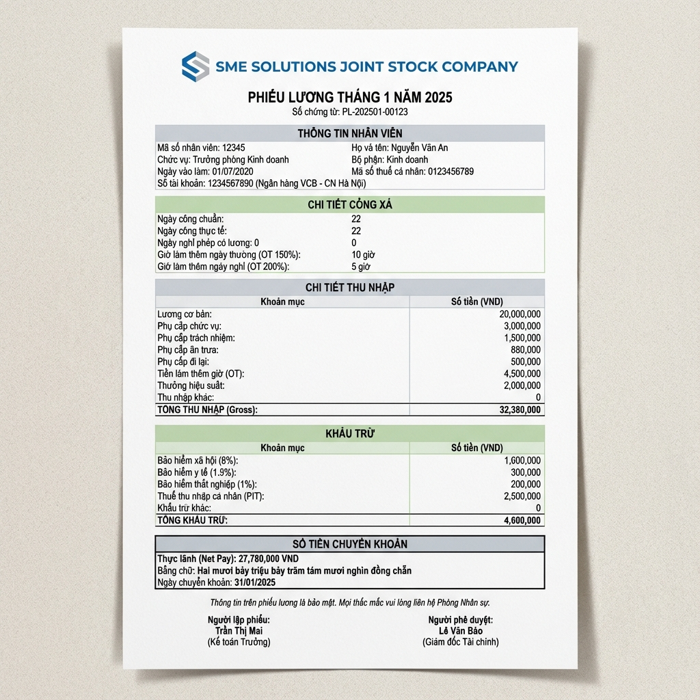

# Hướng dẫn Sử dụng Hệ thống Gửi Phiếu Lương Tự động 2025

Chào mừng bạn đến với phiên bản nâng cấp 2025 của công cụ gửi phiếu lương. Phiên bản này hỗ trợ mẫu phiếu lương chi tiết, chuyên nghiệp và đầy đủ các tiêu chuẩn kế toán Việt Nam.

## 1. Chuẩn bị Bảng tính lương
Để script hoạt động chính xác với mẫu 2025, bảng lương của bạn cần có cấu trúc 40 cột.

**Cách nhanh nhất**:
1. Tải file mẫu [payroll_sample_2025.csv](./payroll_sample_2025.csv).
2. Mở Google Sheets > **Tệp (File)** > **Nhập (Import)** > **Tải lên** file CSV này.
3. Đổi tên sheet vừa nhập thành `T + <số tháng>` (Ví dụ: `T1`).

**Lưu ý**: Dữ liệu nhân viên bắt đầu từ **hàng 2** (Hàng 1 là tiêu đề).

## 2. Cài đặt Script
1. Mở Sheet > **Tiện ích mở rộng (Extensions)** > **Apps Script**.
2. Copy toàn bộ nội dung file `salary_send.js` vào trình soạn thảo.
3. Nhấn **Lưu** và làm mới trang Google Sheets.

## 3. Cách chạy Gửi Phiếu Lương
1. Bấm vào menu **SME Tools** > **Gửi Phiếu Lương PDF (Tháng Hiện Tại)**.
2. Cấp quyền (lần đầu) và chờ thông báo kết quả.

---

## 4. Tùy chỉnh Cấu hình (Không cần sửa Code)

Bạn có thể tạo một sheet tên là **CONFIG** để thay đổi các thông số sau:

| Thông số (Key) | Ý nghĩa | Ví dụ |
| :--- | :--- | :--- |
| **SENDER_NAME** | Tên công ty | SME SOLUTIONS JSC |
| **COL_EMAIL** | Cột chứa Email | F |
| **START_ROW** | Hàng bắt đầu dữ liệu | 2 |
| **CONTACT_EMAIL** | Email liên hệ | hr@sme-solutions.vn |

---

## 5. Mẫu Phiếu Lương PDF (2025)
Phiếu lương gửi tới nhân viên sẽ được trình bày chuyên nghiệp theo nhóm thông tin:

### Các mục hiển thị:
- **Thông tin nhân viên**: Họ tên, Vị trí, Số tài khoản...
- **Chi tiết công xá**: Ngày công, OT, Nghỉ phép...
- **Chi tiết thu nhập**: Lương cứng, Phụ cấp, KPI, Thưởng...
- **Khấu trừ**: Bảo hiểm, Thuế TNCN...
- **Thanh toán**: Thực lĩnh, Tạm ứng, Chuyển khoản cuối cùng.

---
*Phát triển bởi: AI Assistant - SME SOLUTIONS*
